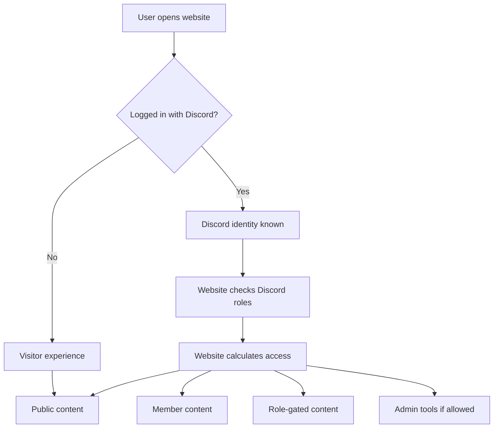
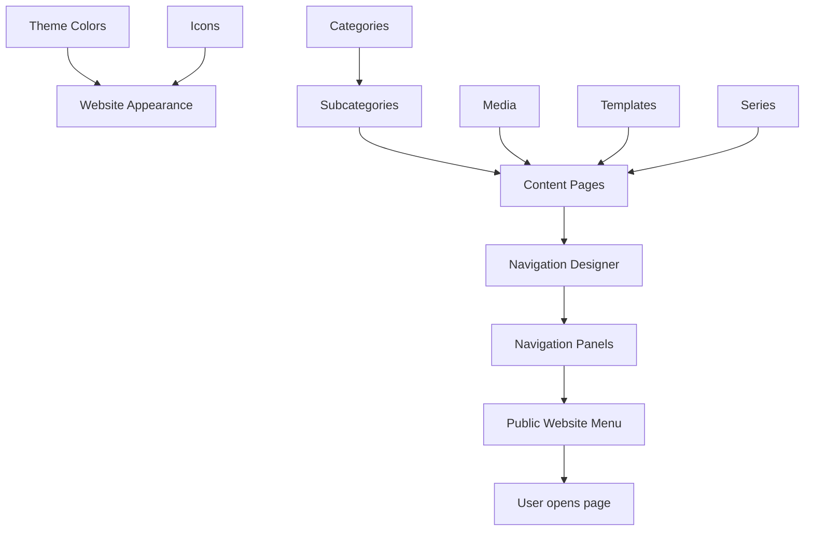
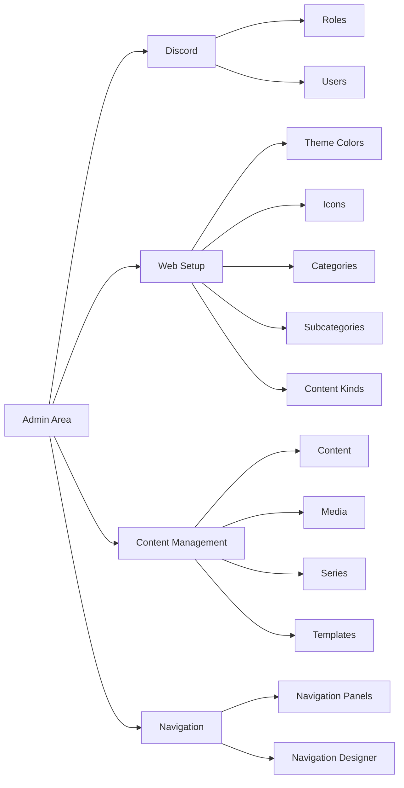
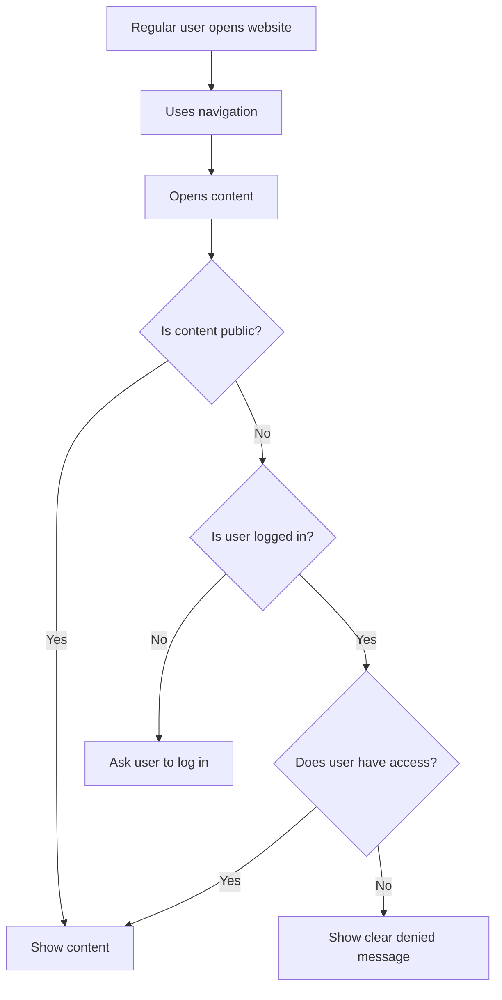

<!-- FILE: docs/production-readiness/04_system_map.md -->

# Corn Mafia Web System Map

## Purpose

This document shows how the main parts of the website connect.

It is meant to give non-technical users a simple mental model of the system.

## 1. User Access Flow



Simple explanation: the website first checks whether the user is logged in. If not logged in, the user is treated as a visitor. If logged in, the website knows the user's Discord identity and can check their roles. Those roles help decide what the user can see or manage.

## 2. Content And Navigation Flow



Simple explanation: categories and subcategories organize the website. Content pages are the actual pages people open. Media, templates, and series help shape content. Navigation panels decide which content appears in menus.

## 3. Admin Management Map



Simple explanation: Discord controls identity and roles. Web setup controls reusable structure. Content management controls pages and files. Navigation controls what appears in menus.

## 4. Regular User Experience Map



Simple explanation: regular users use the menu, open pages, and see only what they are allowed to see.

## 5. How Everything Ties Together

```text
Discord
  controls identity and roles

Roles
  control access

Access
  controls what users can see or manage

Categories and Subcategories
  organize content

Content
  creates the actual pages

Media
  supports content with files and images

Templates
  help structure repeated content

Navigation Panels
  decide what appears in menus

Public Website
  shows the final result to visitors and members
```

## 6. Most Important Rule

Content and navigation are connected, but they are not the same.

```text
Content = the page exists
Navigation = the page appears in a menu
Access = the user is allowed to see it
```

A page should only feel complete when all three are correct:

```text
The content exists.
The navigation points to it.
The right users can access it.
```
